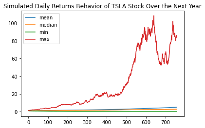
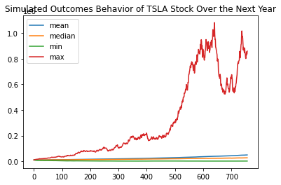

# Student Activity: Financial Forecasting

In this activity, Harold's manager wants Harold to take a look at one year's worth of `TSLA` stock prices and plot a potential stock trajectory for where `TSLA` stock prices could go in the next `3` years. In addition, he would like to know how a $10,000 investment would perform given the simulated results.

Help Harold by creating a Monte Carlo simulation that simulates the next `252 * 3` trading days using three years worth of `TSLA` stock data. Plot the simulated results of `TSLA` daily returns over the next `3` years as well as the corresponding simulated outcomes.


```python
# Import libraries and dependencies
import os
import numpy as np
import pandas as pd
import matplotlib.pyplot as plt
import alpaca_trade_api as tradeapi
from MCForecastTools import MCSimulation

%matplotlib inline
```


```python
# Load .env enviroment variables
from dotenv import load_dotenv
load_dotenv()

# Set Alpaca API key and secret
alpaca_api_key = os.getenv("ALPACA_API_KEY")
alpaca_secret_key = os.getenv("ALPACA_SECRET_KEY")

api = tradeapi.REST(
    alpaca_api_key,
    alpaca_secret_key,
    api_version = "v2"
)
```

### Get 3 Years Worth of Data via API Call and Read in as DataFrame 


```python
# Set the ticker
ticker = "TSLA"

# Set timeframe to '1D'
timeframe = "1D"

# Set start and end datetimes of 3 years from Today
start_date = pd.Timestamp("2017-05-04", tz="America/New_York").isoformat()
end_date = pd.Timestamp("2020-05-04", tz="America/New_York").isoformat()

# Get 3 years worth of historical data for TSLA
ticker_data = api.get_barset(
    ticker,
    timeframe,
    start=start_date,
    end=end_date,
    limit=1000,
).df

ticker_data.head()
```


<div>
<style scoped>
    .dataframe tbody tr th:only-of-type {
        vertical-align: middle;
    }

    .dataframe tbody tr th {
        vertical-align: top;
    }

    .dataframe thead tr th {
        text-align: left;
    }
</style>
<table border="1" class="dataframe">
  <thead>
    <tr>
      <th></th>
      <th colspan="5" halign="left">TSLA</th>
    </tr>
    <tr>
      <th></th>
      <th>open</th>
      <th>high</th>
      <th>low</th>
      <th>close</th>
      <th>volume</th>
    </tr>
  </thead>
  <tbody>
    <tr>
      <th>2017-05-04 00:00:00-04:00</th>
      <td>307.435</td>
      <td>307.77</td>
      <td>290.7601</td>
      <td>295.36</td>
      <td>11653966</td>
    </tr>
    <tr>
      <th>2017-05-05 00:00:00-04:00</th>
      <td>298.000</td>
      <td>308.55</td>
      <td>296.8000</td>
      <td>308.35</td>
      <td>6695227</td>
    </tr>
    <tr>
      <th>2017-05-08 00:00:00-04:00</th>
      <td>310.600</td>
      <td>313.79</td>
      <td>305.8200</td>
      <td>307.20</td>
      <td>5969091</td>
    </tr>
    <tr>
      <th>2017-05-09 00:00:00-04:00</th>
      <td>309.380</td>
      <td>321.99</td>
      <td>309.1000</td>
      <td>321.27</td>
      <td>8158739</td>
    </tr>
    <tr>
      <th>2017-05-10 00:00:00-04:00</th>
      <td>321.560</td>
      <td>325.40</td>
      <td>318.1200</td>
      <td>325.22</td>
      <td>4754047</td>
    </tr>
  </tbody>
</table>
</div>


### Run the Monte Carlo Simulation


```python
# Set number of simulations
num_sims = 1000

# Configure a Monte Carlo simulation to forecast three years daily returns
MC_TSLA = MCSimulation(
    portfolio_data = ticker_data,
    num_simulation = num_sims,
    num_trading_days = 252*3
)
```


```python
# Run Monte Carlo simulations to forecast three years daily returns
MC_TSLA.calc_cumulative_return()
```

    Running Monte Carlo simulation number 0.
    Running Monte Carlo simulation number 10.
    Running Monte Carlo simulation number 20.
    Running Monte Carlo simulation number 30.
    Running Monte Carlo simulation number 40.
    Running Monte Carlo simulation number 50.
    Running Monte Carlo simulation number 60.
    Running Monte Carlo simulation number 70.
    Running Monte Carlo simulation number 80.
    Running Monte Carlo simulation number 90.
    Running Monte Carlo simulation number 100.
    Running Monte Carlo simulation number 110.
    Running Monte Carlo simulation number 120.
    Running Monte Carlo simulation number 130.
    Running Monte Carlo simulation number 140.
    Running Monte Carlo simulation number 150.
    Running Monte Carlo simulation number 160.
    Running Monte Carlo simulation number 170.
    Running Monte Carlo simulation number 180.
    Running Monte Carlo simulation number 190.
    Running Monte Carlo simulation number 200.
    Running Monte Carlo simulation number 210.
    Running Monte Carlo simulation number 220.
    Running Monte Carlo simulation number 230.
    Running Monte Carlo simulation number 240.
    Running Monte Carlo simulation number 250.
    Running Monte Carlo simulation number 260.
    Running Monte Carlo simulation number 270.
    Running Monte Carlo simulation number 280.
    Running Monte Carlo simulation number 290.
    Running Monte Carlo simulation number 300.
    Running Monte Carlo simulation number 310.
    Running Monte Carlo simulation number 320.
    Running Monte Carlo simulation number 330.
    Running Monte Carlo simulation number 340.
    Running Monte Carlo simulation number 350.
    Running Monte Carlo simulation number 360.
    Running Monte Carlo simulation number 370.
    Running Monte Carlo simulation number 380.
    Running Monte Carlo simulation number 390.
    Running Monte Carlo simulation number 400.
    Running Monte Carlo simulation number 410.
    Running Monte Carlo simulation number 420.
    Running Monte Carlo simulation number 430.
    Running Monte Carlo simulation number 440.
    Running Monte Carlo simulation number 450.
    Running Monte Carlo simulation number 460.
    Running Monte Carlo simulation number 470.
    Running Monte Carlo simulation number 480.
    Running Monte Carlo simulation number 490.
    Running Monte Carlo simulation number 500.
    Running Monte Carlo simulation number 510.
    Running Monte Carlo simulation number 520.
    Running Monte Carlo simulation number 530.
    Running Monte Carlo simulation number 540.
    Running Monte Carlo simulation number 550.
    Running Monte Carlo simulation number 560.
    Running Monte Carlo simulation number 570.
    Running Monte Carlo simulation number 580.
    Running Monte Carlo simulation number 590.
    Running Monte Carlo simulation number 600.
    Running Monte Carlo simulation number 610.
    Running Monte Carlo simulation number 620.
    Running Monte Carlo simulation number 630.
    Running Monte Carlo simulation number 640.
    Running Monte Carlo simulation number 650.
    Running Monte Carlo simulation number 660.
    Running Monte Carlo simulation number 670.
    Running Monte Carlo simulation number 680.
    Running Monte Carlo simulation number 690.
    Running Monte Carlo simulation number 700.
    Running Monte Carlo simulation number 710.
    Running Monte Carlo simulation number 720.
    Running Monte Carlo simulation number 730.
    Running Monte Carlo simulation number 740.
    Running Monte Carlo simulation number 750.
    Running Monte Carlo simulation number 760.
    Running Monte Carlo simulation number 770.
    Running Monte Carlo simulation number 780.
    Running Monte Carlo simulation number 790.
    Running Monte Carlo simulation number 800.
    Running Monte Carlo simulation number 810.
    Running Monte Carlo simulation number 820.
    Running Monte Carlo simulation number 830.
    Running Monte Carlo simulation number 840.
    Running Monte Carlo simulation number 850.
    Running Monte Carlo simulation number 860.
    Running Monte Carlo simulation number 870.
    Running Monte Carlo simulation number 880.
    Running Monte Carlo simulation number 890.
    Running Monte Carlo simulation number 900.
    Running Monte Carlo simulation number 910.
    Running Monte Carlo simulation number 920.
    Running Monte Carlo simulation number 930.
    Running Monte Carlo simulation number 940.
    Running Monte Carlo simulation number 950.
    Running Monte Carlo simulation number 960.
    Running Monte Carlo simulation number 970.
    Running Monte Carlo simulation number 980.
    Running Monte Carlo simulation number 990.


<div>
<style scoped>
    .dataframe tbody tr th:only-of-type {
        vertical-align: middle;
    }

    .dataframe tbody tr th {
        vertical-align: top;
    }

    .dataframe thead th {
        text-align: right;
    }
</style>
<table border="1" class="dataframe">
  <thead>
    <tr style="text-align: right;">
      <th></th>
      <th>0</th>
      <th>1</th>
      <th>2</th>
      <th>3</th>
      <th>4</th>
      <th>5</th>
      <th>6</th>
      <th>7</th>
      <th>8</th>
      <th>9</th>
      <th>...</th>
      <th>990</th>
      <th>991</th>
      <th>992</th>
      <th>993</th>
      <th>994</th>
      <th>995</th>
      <th>996</th>
      <th>997</th>
      <th>998</th>
      <th>999</th>
    </tr>
  </thead>
  <tbody>
    <tr>
      <th>0</th>
      <td>1.000000</td>
      <td>1.000000</td>
      <td>1.000000</td>
      <td>1.000000</td>
      <td>1.000000</td>
      <td>1.000000</td>
      <td>1.000000</td>
      <td>1.000000</td>
      <td>1.000000</td>
      <td>1.000000</td>
      <td>...</td>
      <td>1.000000</td>
      <td>1.000000</td>
      <td>1.000000</td>
      <td>1.000000</td>
      <td>1.000000</td>
      <td>1.000000</td>
      <td>1.000000</td>
      <td>1.000000</td>
      <td>1.000000</td>
      <td>1.000000</td>
    </tr>
    <tr>
      <th>1</th>
      <td>0.981222</td>
      <td>0.990782</td>
      <td>1.001497</td>
      <td>0.968636</td>
      <td>1.025662</td>
      <td>0.985579</td>
      <td>0.979159</td>
      <td>0.959626</td>
      <td>0.915200</td>
      <td>1.100719</td>
      <td>...</td>
      <td>1.035320</td>
      <td>0.974333</td>
      <td>1.129787</td>
      <td>0.991942</td>
      <td>1.026417</td>
      <td>1.070166</td>
      <td>1.043902</td>
      <td>1.019487</td>
      <td>0.967719</td>
      <td>0.982966</td>
    </tr>
    <tr>
      <th>2</th>
      <td>0.979845</td>
      <td>0.932936</td>
      <td>0.950812</td>
      <td>1.001255</td>
      <td>0.978447</td>
      <td>0.956805</td>
      <td>0.971956</td>
      <td>0.959406</td>
      <td>0.916128</td>
      <td>1.014008</td>
      <td>...</td>
      <td>1.066326</td>
      <td>0.974253</td>
      <td>1.142736</td>
      <td>1.009477</td>
      <td>1.010455</td>
      <td>1.083022</td>
      <td>1.034498</td>
      <td>1.023799</td>
      <td>0.886175</td>
      <td>0.955799</td>
    </tr>
    <tr>
      <th>3</th>
      <td>0.982248</td>
      <td>0.958489</td>
      <td>0.907635</td>
      <td>1.076008</td>
      <td>0.924043</td>
      <td>0.941103</td>
      <td>0.972826</td>
      <td>0.994823</td>
      <td>0.953968</td>
      <td>1.040536</td>
      <td>...</td>
      <td>1.099464</td>
      <td>0.990134</td>
      <td>1.172254</td>
      <td>0.948681</td>
      <td>0.967827</td>
      <td>1.055193</td>
      <td>1.048936</td>
      <td>1.023842</td>
      <td>0.954594</td>
      <td>0.966601</td>
    </tr>
    <tr>
      <th>4</th>
      <td>1.007947</td>
      <td>0.994389</td>
      <td>0.863432</td>
      <td>1.100683</td>
      <td>0.928010</td>
      <td>0.884032</td>
      <td>0.965998</td>
      <td>0.947342</td>
      <td>0.920592</td>
      <td>1.079854</td>
      <td>...</td>
      <td>1.135327</td>
      <td>0.972608</td>
      <td>1.139030</td>
      <td>0.909896</td>
      <td>0.982004</td>
      <td>1.046113</td>
      <td>0.950495</td>
      <td>0.958808</td>
      <td>0.951463</td>
      <td>0.908549</td>
    </tr>
    <tr>
      <th>...</th>
      <td>...</td>
      <td>...</td>
      <td>...</td>
      <td>...</td>
      <td>...</td>
      <td>...</td>
      <td>...</td>
      <td>...</td>
      <td>...</td>
      <td>...</td>
      <td>...</td>
      <td>...</td>
      <td>...</td>
      <td>...</td>
      <td>...</td>
      <td>...</td>
      <td>...</td>
      <td>...</td>
      <td>...</td>
      <td>...</td>
      <td>...</td>
    </tr>
    <tr>
      <th>752</th>
      <td>2.964285</td>
      <td>6.281219</td>
      <td>3.528422</td>
      <td>5.569597</td>
      <td>1.537283</td>
      <td>1.927135</td>
      <td>1.835281</td>
      <td>2.273169</td>
      <td>4.462258</td>
      <td>6.555616</td>
      <td>...</td>
      <td>2.991133</td>
      <td>3.373659</td>
      <td>3.035196</td>
      <td>1.345995</td>
      <td>0.360124</td>
      <td>34.367965</td>
      <td>1.629844</td>
      <td>8.824132</td>
      <td>3.348889</td>
      <td>10.723148</td>
    </tr>
    <tr>
      <th>753</th>
      <td>2.898127</td>
      <td>5.929781</td>
      <td>3.630850</td>
      <td>5.614963</td>
      <td>1.532372</td>
      <td>1.913588</td>
      <td>1.905665</td>
      <td>2.160138</td>
      <td>4.445566</td>
      <td>6.939099</td>
      <td>...</td>
      <td>3.156057</td>
      <td>3.510643</td>
      <td>3.030412</td>
      <td>1.298904</td>
      <td>0.357633</td>
      <td>34.687223</td>
      <td>1.666808</td>
      <td>9.236994</td>
      <td>3.099606</td>
      <td>10.409932</td>
    </tr>
    <tr>
      <th>754</th>
      <td>2.805524</td>
      <td>5.824232</td>
      <td>3.821479</td>
      <td>6.019107</td>
      <td>1.466395</td>
      <td>1.944477</td>
      <td>1.955238</td>
      <td>2.174833</td>
      <td>4.450806</td>
      <td>6.638072</td>
      <td>...</td>
      <td>3.260135</td>
      <td>3.581977</td>
      <td>2.908168</td>
      <td>1.199393</td>
      <td>0.386841</td>
      <td>36.692925</td>
      <td>1.657787</td>
      <td>9.105443</td>
      <td>3.114519</td>
      <td>10.542502</td>
    </tr>
    <tr>
      <th>755</th>
      <td>2.719517</td>
      <td>5.297904</td>
      <td>3.993555</td>
      <td>6.214585</td>
      <td>1.463815</td>
      <td>1.966690</td>
      <td>1.964821</td>
      <td>2.180150</td>
      <td>4.592842</td>
      <td>6.726524</td>
      <td>...</td>
      <td>3.448536</td>
      <td>3.769620</td>
      <td>3.132997</td>
      <td>1.138237</td>
      <td>0.379576</td>
      <td>37.370551</td>
      <td>1.649728</td>
      <td>9.167870</td>
      <td>3.188418</td>
      <td>10.650525</td>
    </tr>
    <tr>
      <th>756</th>
      <td>2.812057</td>
      <td>5.466324</td>
      <td>3.981998</td>
      <td>6.201528</td>
      <td>1.494064</td>
      <td>2.016463</td>
      <td>1.833008</td>
      <td>2.172569</td>
      <td>4.570772</td>
      <td>6.460053</td>
      <td>...</td>
      <td>3.498799</td>
      <td>3.943865</td>
      <td>3.263377</td>
      <td>1.214728</td>
      <td>0.371717</td>
      <td>37.689524</td>
      <td>1.629001</td>
      <td>9.286477</td>
      <td>3.326631</td>
      <td>10.344296</td>
    </tr>
  </tbody>
</table>
<p>757 rows × 1000 columns</p>
</div>


### Plot the Simulated Daily Returns Trajectory for `TSLA` over the Next Year (252 Trading Days)


```python
# Compute summary statistics from the simulated daily returns
simulated_returns_data = {
    "mean": list(MC_TSLA.simulated_return.mean(axis=1)),
    "median": list(MC_TSLA.simulated_return.median(axis=1)),
    "min": list(MC_TSLA.simulated_return.min(axis=1)),
    "max": list(MC_TSLA.simulated_return.max(axis=1))
}

# Create a DataFrame with the summary statistics
df_simulated_returns = pd.DataFrame(simulated_returns_data)

# Display sample data
df_simulated_returns.head()
```


<div>
<style scoped>
    .dataframe tbody tr th:only-of-type {
        vertical-align: middle;
    }

    .dataframe tbody tr th {
        vertical-align: top;
    }

    .dataframe thead th {
        text-align: right;
    }
</style>
<table border="1" class="dataframe">
  <thead>
    <tr style="text-align: right;">
      <th></th>
      <th>mean</th>
      <th>median</th>
      <th>min</th>
      <th>max</th>
    </tr>
  </thead>
  <tbody>
    <tr>
      <th>0</th>
      <td>1.000000</td>
      <td>1.000000</td>
      <td>1.000000</td>
      <td>1.000000</td>
    </tr>
    <tr>
      <th>1</th>
      <td>1.002953</td>
      <td>1.002788</td>
      <td>0.856863</td>
      <td>1.129787</td>
    </tr>
    <tr>
      <th>2</th>
      <td>1.005907</td>
      <td>1.005676</td>
      <td>0.826181</td>
      <td>1.203377</td>
    </tr>
    <tr>
      <th>3</th>
      <td>1.007616</td>
      <td>1.006666</td>
      <td>0.801393</td>
      <td>1.232933</td>
    </tr>
    <tr>
      <th>4</th>
      <td>1.008332</td>
      <td>1.004927</td>
      <td>0.768805</td>
      <td>1.294849</td>
    </tr>
  </tbody>
</table>
</div>


```python
# Use the `plot` function to visually analyze the trajectory of TSLA stock daily returns on the next three years of trading days simulation
df_simulated_returns.plot(title="Simulated Daily Returns Behavior of TSLA Stock Over the Next Year")
```


    <matplotlib.axes._subplots.AxesSubplot at 0x7faaf8c88610>


    

    


### Calculate the Simulated Profits/Losses of $10,000 Investment in `TSLA` Over the Next Three Years


```python
# Set initial investment
initial_investment = 10000

# Multiply an initial investment by the daily returns of simulative stock prices to return the progression of daily returns in terms of money
cumulative_pnl = initial_investment * df_simulated_returns

# Display sample data
cumulative_pnl.head()
```


<div>
<style scoped>
    .dataframe tbody tr th:only-of-type {
        vertical-align: middle;
    }

    .dataframe tbody tr th {
        vertical-align: top;
    }

    .dataframe thead th {
        text-align: right;
    }
</style>
<table border="1" class="dataframe">
  <thead>
    <tr style="text-align: right;">
      <th></th>
      <th>mean</th>
      <th>median</th>
      <th>min</th>
      <th>max</th>
    </tr>
  </thead>
  <tbody>
    <tr>
      <th>0</th>
      <td>10000.000000</td>
      <td>10000.000000</td>
      <td>10000.000000</td>
      <td>10000.000000</td>
    </tr>
    <tr>
      <th>1</th>
      <td>10029.532050</td>
      <td>10027.879860</td>
      <td>8568.632158</td>
      <td>11297.874167</td>
    </tr>
    <tr>
      <th>2</th>
      <td>10059.066285</td>
      <td>10056.758964</td>
      <td>8261.814625</td>
      <td>12033.766254</td>
    </tr>
    <tr>
      <th>3</th>
      <td>10076.159026</td>
      <td>10066.656818</td>
      <td>8013.931073</td>
      <td>12329.325621</td>
    </tr>
    <tr>
      <th>4</th>
      <td>10083.317080</td>
      <td>10049.269047</td>
      <td>7688.053281</td>
      <td>12948.490424</td>
    </tr>
  </tbody>
</table>
</div>


### Plot the Simulated Profits/Losses of $10,000 Investment in `TSLA` Over the Next `252` Trading Days


```python
# Use the 'plot' function to create a chart of the simulated profits/losses
cumulative_pnl.plot(title="Simulated Outcomes Behavior of TSLA Stock Over the Next Year")
```


    <matplotlib.axes._subplots.AxesSubplot at 0x7faaf2e62190>


    

    


### Calculate the range of the possible outcomes of our $10,000 investments in `TSLA` stocks


```python
# Fetch summary statistics from the Monte Carlo simulation results
tbl = MC_TSLA.summarize_cumulative_return()

# Print summary statistics
print(tbl)
```

    count           1000.000000
    mean               4.906131
    std                6.899562
    min                0.126797
    25%                1.232316
    50%                2.655507
    75%                6.011975
    max               85.991793
    95% CI Lower       0.371666
    95% CI Upper      23.772773
    Name: 756, dtype: float64


```python
# Use the lower and upper `95%` confidence intervals to calculate the range of the possible outcomes of our $10,000 investments in TSLA stocks
ci_lower = round(tbl[8]*10000,2)
ci_upper = round(tbl[9]*10000,2)

# Print results
print(f"There is a 95% chance that an initial investment of $10,000 in the portfolio"
      f" over the next year will end within in the range of"
      f" ${ci_lower} and ${ci_upper}.")
```

    There is a 95% chance that an initial investment of $10,000 in the portfolio over the next year will end within in the range of $3716.66 and $237727.73.

